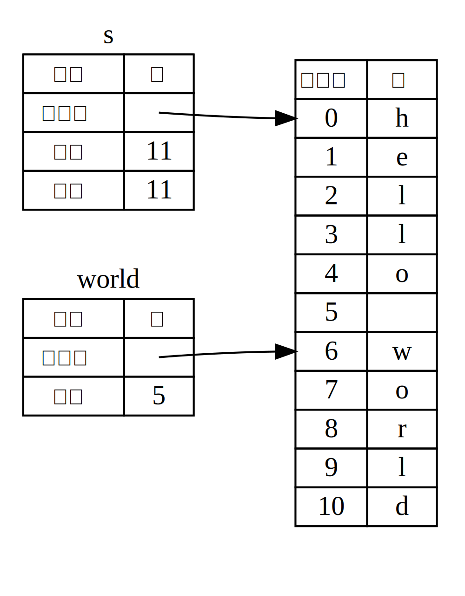

## 슬라이스

*슬라이스 (slice)* 는 컬렉션 (collection) 을 통째로 참조하는 것이 아닌,
컬렉션의 연속된 일련의 요소를 참조하도록 해줍니다. 슬라이스는 참조자의
일종으로서 소유권을 갖지 않습니다.

한번 간단한 함수를 만들어 봅시다. 공백문자로 구분된 단어들의 문자열을
입력받아서 해당 문자열의 첫 번째 단어를 반환하는 함수를요.
공백문자를 찾을 수 없으면 문자열 전체가 하나의 단어라는 뜻이니
전체 문자열을 반환하도록 합시다.

이 문제를 슬라이스로 해결할 수 있음을 이해해 보기 위해서, 먼저 슬라이스 없이
이 함수의 시그니처를 어떻게 작성할지부터 생각해 봅시다:

```rust,ignore
fn first_word(s: &String) -> ?
```

`first_word` 함수는 소유권을 가질 필요가 없으니 `&String`을 매개변수로 갖게 했습니다.
그런데, 뭘 반환해야 할까요? 문자열 *일부분*을 나타내는 법을 모르겠네요.
일단 예제 4-7처럼 공백문자를 가리키는 단어 끝부분의 인덱스를
반환하도록 만들어 보겠습니다.

<span class="filename">파일명: src/main.rs</span>

```rust
{{#rustdoc_include ../listings/ch04-understanding-ownership/listing-04-07/src/main.rs:here}}
```

<span class="caption">예제 4-7: `String` 매개변수의 바이트 인덱스 값을 반환하는
`first_word` 함수</span>

`String`을 하나하나 쪼개서
해당 요소가 공백 값인지 확인해야 하므로,
`as_bytes` 메서드를 이용해 바이트 배열로 변환하였습니다.

```rust,ignore
{{#rustdoc_include ../listings/ch04-understanding-ownership/listing-04-07/src/main.rs:as_bytes}}
```

그다음, 바이트 배열에 사용할 반복자(iterator)를 `iter` 메서드로 생성했습니다:

```rust,ignore
{{#rustdoc_include ../listings/ch04-understanding-ownership/listing-04-07/src/main.rs:iter}}
```

반복자 (iterator) 는 [13장][ch13]<!-- ignore -->에서 자세히 알아볼
예정이니, 일단 `iter` 메서드는 컬렉션의 각 요소를 반환하고,
`enumerate` 메서드는 `iter`의 각 결괏값을
튜플로 감싸 반환한다는 것만 알아두도록 합시다.
이때 반환하는 튜플은 첫 번째 요소가 인덱스,
두 번째 요소가 해당 요소의 참조자로 이루어져 있습니다.

`enumerate` 메서드가 반환한 튜플은 패턴을 이용해 해체하였습니다.
패턴에 대해서는 [6장][ch6]<!-- ignore -->에서 더 자세히 다루겠습니다.
`for` 루프 내에서 `i`는  튜플 요소 중 인덱스에 대응하고,
`&item`은 바이트에 대응됩니다. 이때 패턴에 `&`를 사용하는
이유는 `iter().enumerate()`에서 얻은 요소의 참조자가 필요하기
때문입니다.

`for` 반복문 내에서는 바이트 리터럴 문법으로 공백문자를
나타내는 바이트를 찾고, 찾으면 해당 위치를 반환합니다.
찾지 못했을 땐 `s.len()` 으로 문자열의 길이를 반환합니다.

```rust,ignore
{{#rustdoc_include ../listings/ch04-understanding-ownership/listing-04-07/src/main.rs:inside_for}}
```

이제 문자열에서 첫 번째 단어 끝의 인덱스를 찾는 방법이
생겼지만, 문제가 있습니다. `usize`를 반환하고 있는데, 이는
`&String`의 컨텍스트에서만 의미 있는 숫자일 뿐입니다. 바꿔
말하면, `String`과는 별개의 값이기 때문에 향후에도 유효하다는
보장이 없습니다. 예제 4-7의 `first_word` 함수를 사용하는
예제 4-8의 프로그램을 살펴봅시다.

<span class="filename">파일명: src/main.rs</span>

```rust
{{#rustdoc_include ../listings/ch04-understanding-ownership/listing-04-08/src/main.rs:here}}
```

<span class="caption">예제 4-8: `first_word` 함수의 결과를 저장했으나,
이후에 `String`의 내용물이 변경된 상황</span>

이 코드는 문법적으로 전혀 문제없고, 정상적으로 컴파일됩니다.
`s.clear()`를 호출한 후에 `word`를 사용하는 코드를 작성하더라도,
`word`는 `s`와 분리되어 있으니 결과는 마찬가지죠.
하지만 `word`에 담긴 값 `5`를 본래 목적대로 `s`에서 첫 단어를 추출하는 데 사용할 경우,
버그를 유발할 수도 있습니다. `s`의 내용물은 변경되었으니까요.

그렇다고, 혹여나 `word` 값이 `s`의 데이터 변경을 제때 반영하지 못했을까
전전긍긍할 순 없는 노릇이죠. 심지어 `second_word` 함수를 추가로 만들어야 한다면 어떨까요?
다음과 같은 함수를 정의하고 나면, 관리할 인덱스가 한둘이 아닐 겁니다:

```rust,ignore
fn second_word(s: &String) -> (usize, usize) {
```

두 번째 단어이니 시작, 끝 두 개의 인덱스가 필요할 것이고,
이는 앞선 예제 4-8의 `word`처럼 어떠한 데이터의 특정 상태에만
의존하는 값들이 늘어남을 의미합니다. 그러면 여러분은 3개의 관련 없는
변수들을 계속 동기화해야겠죠.

다행히도, 러스트에는 문자열 슬라이스라는 적절한 대안이 존재합니다.

### 문자열 슬라이스

문자열 슬라이스 (string slice) 는 `String`의 일부를 가리키는 참조자를 말합니다:

```rust
{{#rustdoc_include ../listings/ch04-understanding-ownership/no-listing-17-slice/src/main.rs:here}}
```

만드는 방식은 `String` 참조자와 유사하지만, `hello`는 추가적인 `[0..5]`으로
명시된 `String`의 일부분을 가리키는 참조자입니다.
`[starting_index..ending_index]`는  `starting_index`부터 시작해 `ending_index` 직전,
즉 `ending_index` 에서 1을 뺀 위치까지 슬라이스를 생성한다는 의미입니다.
슬라이스는 내부적으로 시작 위치, 길이를 데이터 구조에 저장하며,
길이 값은 `ending_index` 값에서 `starting_index` 값을 빼서 계산합니다.
따라서 `let world = &s[6..11];`의 `world`는
시작 위치로 `s`의 (1부터 시작하여) 7번째 바이트를 가리키는 포인터와,
길이 값 5를 갖는 슬라이스가 되겠죠.

그림 4-6는 위 내용을 다이어그램으로 그린 것입니다:



<span class="caption">그림 4-6: `String` 일부를 참조하는
문자열 슬라이스</span>

`..` 범위 표현법은 인덱스 0부터 시작하는 경우, 앞의 값을 생략할 수 있습니다.
즉 다음 코드에 등장하는 두 슬라이스 표현은 동일합니다:

```rust
let s = String::from("hello");

let slice = &s[0..2];
let slice = &s[..2];
```

마찬가지로, `String` 맨 마지막 바이트까지 포함하는 슬라이스는 뒤의 값을 생략할 수 있습니다.
다음 코드에 등장하는 두 슬라이스 표현은 동일합니다:

```rust
let s = String::from("hello");

let len = s.len();

let slice = &s[3..len];
let slice = &s[3..];
```

앞뒤 모두 생략할 경우, 전체 문자열이 슬라이스로 생성됩니다.
다음 코드에 등장하는 두 슬라이스 표현은 동일합니다:

```rust
let s = String::from("hello");

let len = s.len();

let slice = &s[0..len];
let slice = &s[..];
```

> Note: 본 내용은 문자열 슬라이스를 소개할 목적이기에 ASCII 문자만 사용하여 문제가
> 발생하지 않았지만, UTF-8 문자열 슬라이스 생성 시 인덱스는 반드시 올바른 UTF-8 문자
> 경계로 지정되어야 합니다. 멀티바이트 문자의 중간 부분에 슬라이스를 생성할 경우,
> 프로그램은 에러와 함께 강제 종료됩니다. UTF-8 문자를 다루는 방법은 8장
> [“문자열에 UTF-8 텍스트를 저장하기”][strings]<!-- ignore -->절에서
> 자세히 알아보겠습니다.

여태 다룬 내용을 잘 기억해 두고, `first_word` 함수가 슬라이스를 반환하도록 재작성해 봅시다.
문자열 슬라이스를 나타내는 타입은 `&str`로 작성합니다.

<span class="filename">파일명: src/main.rs</span>

```rust
{{#rustdoc_include ../listings/ch04-understanding-ownership/no-listing-18-first-word-slice/src/main.rs:here}}
```

예제 4-7과 같은 방법으로
단어의 끝부분 인덱스를 알아내되,
공백문자 발견 시 해당 인덱스를 그대로 반환하는 것이 아니라
문자열 맨 앞부터 알아낸 위치까지 문자열 슬라이스를 생성하여 반환합니다.

이제 `first_word`가 반환하는 값은 원래 데이터와 분리된 값이 아닙니다.
이 값은 원래 데이터에서 슬라이스 시작 위치를 가리키는 참조자와,
슬라이스 요소 개수로 구성되어 있습니다.

`second_word` 함수도 슬라이스를 반환하도록 바꿔보겠습니다:

```rust,ignore
fn second_word(s: &String) -> &str {
```

사용법이 훨씬 직관적이지 않나요? 또한 예제 4-8에서 말한
첫 단어의 끝부분 인덱스를 찾은 이후 문자열이 비워지면 찾아낸
인덱스가 쓸모없어지는 문제도 해결했습니다. 이제는 컴파일러가
`String`을 가리키는 참조자의 유효함을 보증하니까요.
기존 코드는 논리적으로 맞지 않음에도 불구하고 에러가 나타나지 않았습니다.
비어 있는 문자열에서 첫 번째 단어의 인덱스를 이용할 때가 되어서야 에러가 나타났죠.
하지만 슬라이스를 사용하면 이런 버그를 미연에 방지하고,
발생할지도 모를 문제마저 사전에 알 수 있습니다. 이제 슬라이스로 만든
`first_word`를 잘못된 방법으로 사용했을 때 컴파일 에러가 제대로 나타나는지 확인해 보죠:

<span class="filename">파일명: src/main.rs</span>

```rust,ignore,does_not_compile
{{#rustdoc_include ../listings/ch04-understanding-ownership/no-listing-19-slice-error/src/main.rs:here}}
```

컴파일러 에러는 다음과 같습니다:

```console
{{#include ../listings/ch04-understanding-ownership/no-listing-19-slice-error/output.txt}}
```

이전 절에서 배운 빌림 규칙 중에서 특정 대상의 불변 참조자가 이미 존재할 경우에는
가변 참조자를 만들 수 없다는 규칙이 있었죠. `clear` 함수는 `String`의 길이를
변경해야 하니 가변 참조자가 필요합니다. `clear` 호출 이후 `println!`는 `word`의
참조자를 사용하므로, 이 불변 참조자는 이 지점까지 계속 활성화되어 있어야 합니다.
러스트는 `clear` 내의 가변 참조자와 `word`의 불변 참조자가 같은 시점에 존재하는
것을 허용하지 않으므로 컴파일 에러가 발생합니다. 이런 식으로 러스트는 우리가 더
간단히 사용할 수 있는 API를 만들도록 도와주고, 다양한 에러를 컴파일 타임에
제거해 줍니다.

<!-- Old heading. Do not remove or links may break. -->
<a id="string-literals-are-slices"></a>

#### 슬라이스로써의 문자열 리터럴

앞서, 문자열 리터럴은 바이너리 내에 저장된다는 이야기를 잠깐 언급했는데, 기억하시나요?
슬라이스를 배웠으니, 문자열 리터럴도 제대로 이해해 봅시다:

```rust
let s = "Hello, world!";
```

여기서 `s`는 바이너리의 특정 지점을 가리키는 슬라이스입니다. `&str` 타입이죠.
`&str`은  불변 참조자이므로, 문자열 리터럴은 왜 변경할 수 없는지에 대한 의문도
풀립니다.

#### 문자열 슬라이스를 매개변수로 사용하기

리터럴과 `String`의 슬라이스를 만들 수 있다는 걸 알고 나면
`first_word` 함수 정의를 다음과 같이 작성할 수 있습니다:

```rust,ignore
fn first_word(s: &String) -> &str {
```

좀 더 경험이 많은 러스타시안은
다음 예제 4-9처럼 `&String` 값과 `&str` 값
모두 사용 가능한 함수를 작성할 것입니다.

```rust,ignore
{{#rustdoc_include ../listings/ch04-understanding-ownership/listing-04-09/src/main.rs:here}}
```

<span class="caption">예제 4-9: 매개변수 `s`를 문자열 슬라이스 타입으로 변경하겨
`first_word` 함수 개선하기</span>

문자열 슬라이스라면 이를 바로 인수로써 전달할 수 있습니다. `String`이라면
`String`의 슬라이스 혹은 `String`에 대한 참조자를 전달할 수 있습니다.
이러한 유연성은 *역참조 강제 (deref coercions)* 기능을 이용하는데, 15장의
[“함수와 메서드를 이용한 암묵적 역참조 강제”][deref-coercions]<!--ignore-->절에서
다룰 것입니다.

`String`에 대한 참조자 대신에 문자열 슬라이스를 매개변수로 하는 함수를 정의하면
기능 면에서 손해보지 않으면서 API를 더 일반적이고 유용하게 만들어 줍니다:

<span class="filename">파일명: src/main.rs</span>

```rust
{{#rustdoc_include ../listings/ch04-understanding-ownership/listing-04-09/src/main.rs:usage}}
```

### 그 외 슬라이스

문자열 슬라이스는 짐작하셨듯 문자열에만 특정되어 있습니다. 하지만
더 범용적인 슬라이스 타입도 존재합니다. 아래 배열을 봅시다:

```rust
let a = [1, 2, 3, 4, 5];
```

문자열 일부를 참조할 때처럼 다음과 같이 배열 일부를 참조하고
싶다면 다음과 같이 할 수 있습니다:

```rust
let a = [1, 2, 3, 4, 5];

let slice = &a[1..3];

assert_eq!(slice, &[2, 3]);
```

이 슬라이스는 `&[i32]` 타입입니다. 동작 방식은 문자열 슬라이스와
동일합니다. 슬라이스의 첫 번째 요소를 참조하는 참조자와 슬라이스의
길이를 저장하여 동작하죠. 이런 슬라이스는 모든 컬렉션에 사용 가능합니다.
컬렉션은 8장에서 자세히 알아볼 예정입니다.

## 정리

소유권, 빌림, 슬라이스는 러스트가 컴파일 타임에 메모리 안정성을 보장하는
비결입니다. 여타 시스템 프로그래밍 언어처럼 프로그래머에게 메모리 사용 제어
권한을 주면서, 어떠한 데이터의 소유자가 스코프를 벗어날 경우 자동으로 해당
데이터를 정리하는 것이 가능하죠. 또한 제어 코드를 추가 작성하고 디버깅할
필요가 사라지니 프로그래머의 일이 줄어드는 결과도 가져옵니다.

소유권은 수많은 러스트 요소들의 동작 방법에
영향을 미치는 개념인 만큼 이후 내용에서도 계속해서 다룰 예정입니다.
그러면 이제 5장에서 `struct`로 여러 데이터를 묶는 방법을 알아보죠.

[ch13]: ch13-02-iterators.html
[ch6]: ch06-02-match.html#patterns-that-bind-to-values
[strings]: ch08-02-strings.html#storing-utf-8-encoded-text-with-strings
[deref-coercions]: ch15-02-deref.html#implicit-deref-coercions-with-functions-and-methods
